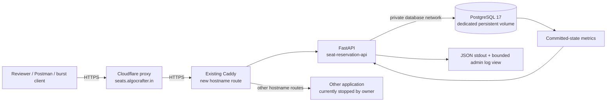
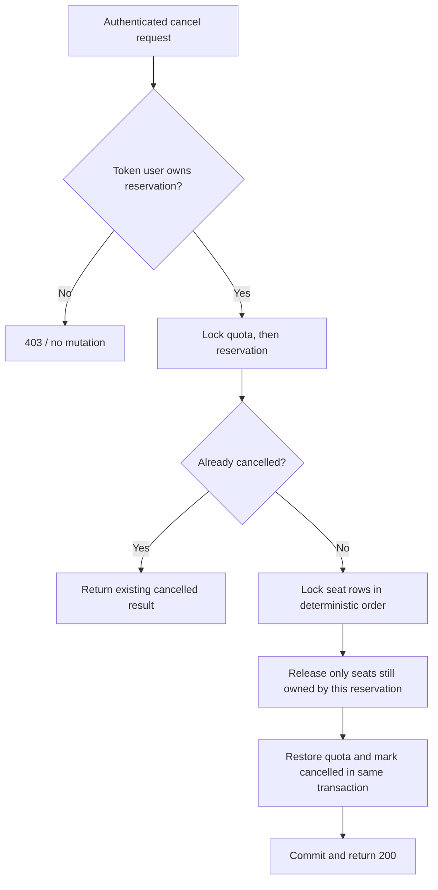

# Architecture and request flow

## Live deployment



Only the reverse proxy network is shared. The reservation database has no published
host port. A loopback API port is available for operator checks. Dedicated container
CPU and memory limits contain resource use; the VM and Caddy remain shared infrastructure.
There is one API process in this deployment. PostgreSQL coordinates correctness if
additional API instances are introduced.

## Reservation transaction

```mermaid
sequenceDiagram
    participant C as Client
    participant A as API
    participant D as PostgreSQL
    C->>A: seats + idempotency key + user JWT
    A->>A: Queue admission, validate identity and body
    A->>D: BEGIN; claim unique user/operation/key
    alt Key already committed
        A->>D: Compare canonical body and read saved response
        D-->>A: Original result or body conflict
        A->>D: Record replay/conflict outcome; COMMIT
        A-->>C: 200 replay or saved decline / 409 conflict
    else New key
        A->>D: Lock user/show quota row
        A->>D: Lock requested seat rows in sorted order
        alt Limit and all seats available
            A->>D: Insert reservation; update seats and quota
            A->>D: Save original response; COMMIT
            A-->>C: 201 confirmed
        else Domain rule fails
            A->>D: Save decline; COMMIT without inventory change
            A-->>C: 409 conflict or 404 unknown resource
        end
    end
    A->>A: Correlated structured completion log
```

The unique idempotency row serializes the same key; the quota row serializes one
user's total; seat row locks serialize ownership decisions. All are in one transaction.
Different unrelated users and seats can progress concurrently. The Python admission
semaphore limits memory consumption; it does not decide seat ownership.

## Owner cancellation



PostgreSQL is the authority during failures. Database loss fails readiness and blocks
new mutations. API restart restores no local ownership state because ownership and
idempotency were committed durably. A response lost after commit is resolved by a retry.
